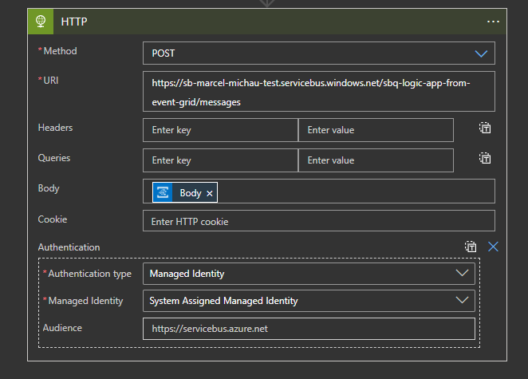
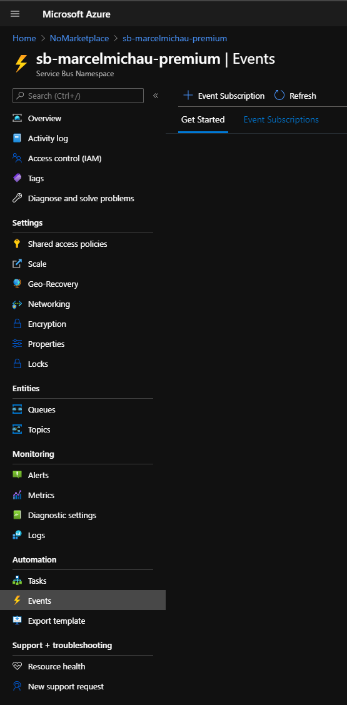
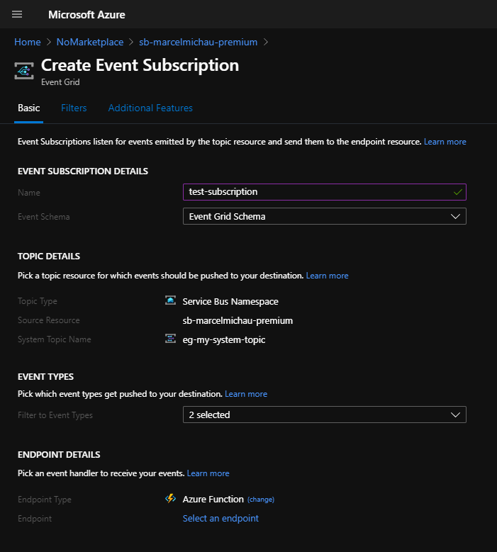

# Azure Service Bus Reference for .NET

This sample project provides examples of using Azure Service Bus with the Azure Service Bus SDK for .NET.

The solution consists of two projects:

- Producer - contains examples for sending messages to Azure Service Bus Queues & Topics
- Consumer - contains examples for receiving messages from Azure Service Bus Queues & Topic Subscriptions

## Prerequisites

The code samples use the [Azure Identity client library for .NET](https://docs.microsoft.com/en-gb/dotnet/api/overview/azure/identity-readme?view=azure-dotnet) to authenticate with Azure Service Bus. Depending on how you run the samples, make sure the following is in place:

- Visual Studio - Sign into Visual Studio with the same Microsoft Account you use for Azure.
- .NET CLI - Sign into the Azure CLI with the same Microsoft Account you use for Azure using `az login`.

These steps assume that you have an existing Resource Group with permissions to deploy resources into it.

1. Ensure you have the latest version of the [Azure CLI](https://docs.microsoft.com/en-us/cli/azure/install-azure-cli?view=azure-cli-latest) installed.

2. Create an Azure Service Bus Namespace for testing:

```
az servicebus namespace create --resource-group <resource_group_name> --name <your_service_bus_namespace_name> --location southafricanorth
```

3. Grab the Service Bus Endpoint URL in the format `<your_service_bus_namespace_name>.servicebus.windows.net` and paste that into `Common/Config.cs`.

4. The examples create/delete the necessary Queues + Topics + Subscriptions in code. In order to allow this, assign yourself the `Azure Service Bus Data Owner` Role to the Service Bus you just created:

```
Get your Azure AD Object ID:
az ad signed-in-user show --query objectId

Create the Role Assignment:
az role assignment create --assignee <your_azure_ad_object_id> --role "Azure Service Bus Data Owner" --scope /subscriptions/<your_subscription_id>/resourceGroups/<resource_group_name>/providers/Microsoft.ServiceBus/namespaces/<your_service_bus_namespace_name>
```

## Running the examples

Firstly, open up either of the Producer or Consumer project's `Program.cs` files & un-comment the example you'd like to run, making sure to un-comment the corresponding line in the opposite project.

Open up a Terminal & change into the Consumer directory & run the Consumer project

```
dotnet run
```

In a separate Terminal window, change into the Producer directory & run the Producer project

```
dotnet run
```

## Integration with Other Azure Services

### Azure Logic Apps

**From Logic App to Service Bus Queue/Topic**

Logic Apps do not natively support connecting to Service Bus using the Logic App Managed Identity. A workaround for this is to call the Service Bus REST API with a HTTP Webhook step from the Logic App as follows:
   

   - Method: `POST`
   - URI: `https://<service bus name>.servicebus.windows.net/<queue or topic name>/messages`
   - Body: Message Body (from previous step or otherwise)
   - Authentication type: `Managed Identity`
   - Managed Identity: `System Assigned Managed Identity`
   - Audience: `https://servicebus.azure.net`

### Azure Event Grid

**From Service Bus Queue/Subscription to Event Grid**

To subscribe to a Service Bus queue from Event Grid, you will require a premium Service Bus namespace as the standard namespace does not support events.

1. Navigate to `Events` on the Premium Service Bus namespace & click on `+ Event Subscription` to create a new Event Grid System Topic to subscribe to:
   
   

2. On the `Create Event Subscription` blade, capture the following information:

   

   - Event Subscription Details
     - Name: Meaningful name of the subscription
     - Event Schema: `Event Grid Schema`
   - Topic Details
     - System Topic Name: Meaningful Name for your Event Grid System Topic
   - Endpoint Details
     - The destination endpoint to forward events to (i.e. Azure Function/Web Hook/Storage Queues/Event Hubs/Hybrid Connections/Service Bus Queue/Service Bus Topic)

The event which is published to the Endpoint does *not* contain the message data, only the details of the Service Bus queue/subscription which received the message. It is up to the subscribing app (e.g. Azure Function) to use the information in this event to pick the message off of the relevant queue.

More information on integration with Event Grid can be found here: https://docs.microsoft.com/en-us/azure/service-bus-messaging/service-bus-to-event-grid-integration-concept

## Known Issues

### AuthenticationFailedException is thrown when starting Console app

Sometimes when running the samples from the .NET CLI using `dotnet run`, an `AuthenticationFailedException` can be thrown indicating an Authorization issue with the Azure CLI. To workaround this, use the `InteractiveBrowserCredential` for `Azure.Identity` by commenting out the `DefaultAzureCredential` in `Common/Config.cs` & replacing it with the `InteractiveBrowserCredential` option below it.
